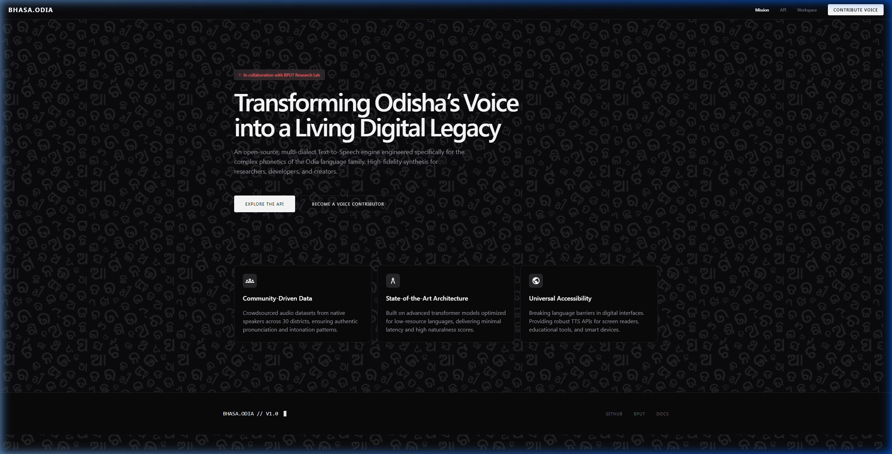
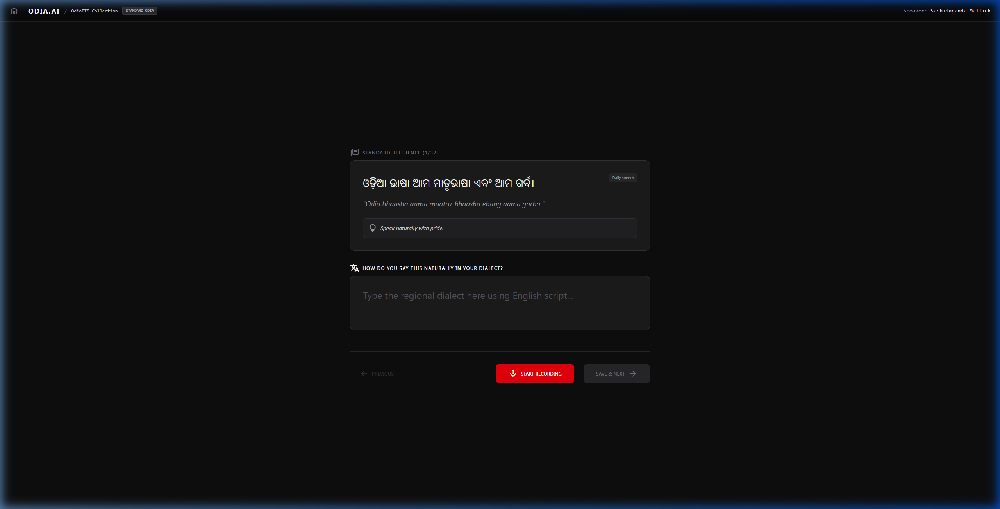
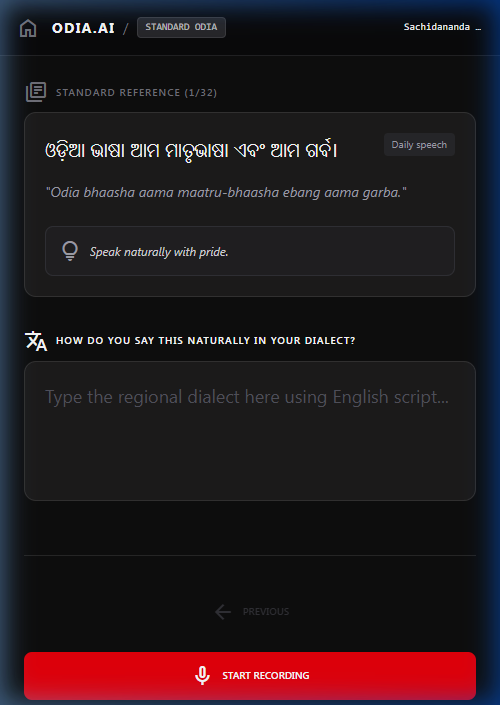
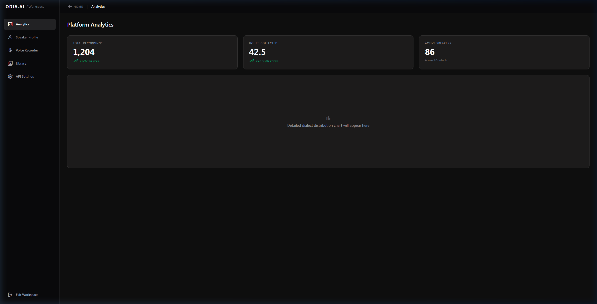

# OdiaTTS: Transforming Odisha's Voice into a Digital Legacy 🎙️✨

OdiaTTS is a state-of-the-art, open-source Text-to-Speech (TTS) research project dedicated to the complex phonetics and diverse dialects of the Odia language. In collaboration with the **BPUT Research Lab**, we are building a living digital legacy for 35 million voices.

---

## 🚀 Vision
Most AI models overlook the linguistic nuances of regional Indian languages. Odia, with its unique phonetic structure and over 30+ regional dialects, requires a specialized, community-driven approach. OdiaTTS aims to bridge the digital divide by providing high-fidelity, natural-sounding voice synthesis for everyone.

## 📸 Interface Preview

### 🏠 Cinematic Landing Page
A premium, interactive experience designed to showcase the mission and scale of the project.

### 🎙️ Multi-Dialect Data Collection
A specialized interface for native speakers to contribute their voices and translate standard Odia into regional dialects (e.g., Sambalpuri, Desiya, Baleswari).
| Desktop View | Mobile View |
|--------------|-------------|
|  |  |

### 📊 Research Analytics
Real-time tracking of dataset growth, dialect distribution, and speaker demographics.

---

## 🛠️ How it Works
1.  **Crowdsourced Data**: Native speakers contribute audio samples and dialect-specific translations.
2.  **Transformer Architecture**: We use state-of-the-art deep learning models optimized for low-resource languages.
3.  **Linguistic Validation**: Data is verified for phonetic accuracy and regional authenticity.
4.  **Universal API**: Developers can integrate high-quality Odia TTS into screen readers, educational apps, and smart devices.

## 🌟 Why this matters
-   **Preservation**: Digitally preserving endangered dialects and linguistic nuances.
-   **Accessibility**: Empowering visually impaired Odia speakers with high-quality screen readers.
-   **Education**: Enabling interactive learning tools in native tongues for students across Odisha.

## 🤝 How to Contribute
We need your help to make OdiaTTS a reality!

### 🗣️ For Native Speakers
-   **Contribute Voice**: Record sentences in your natural dialect.
-   **Translate**: Help us adapt standard Odia texts into regional variations.

### 💻 For Developers & Researchers
-   **Model Training**: Help optimize transformer architectures for Odia phonetics.
-   **UI/UX**: Improve our collection and analytics interfaces.
-   **Data Engineering**: Build robust pipelines for audio processing and validation.

### 📍 Regional Ambassadors
-   Help us reach speakers in all 30 districts of Odisha!

---

## 🛠️ Tech Stack
-   **Frontend**: React, TypeScript, Tailwind CSS, Framer Motion (for premium animations).
-   **Backend**: Google Apps Script (Serverless), Google Drive (Storage).
-   **Icons**: Material Symbols.
-   **Design**: Custom-built premium dark aesthetic.

## 📜 License
This project is open-source and intended for research and community use.

---
*Developed with ❤️ for Odisha.*
**BHASA.ODIA // V1.0**
